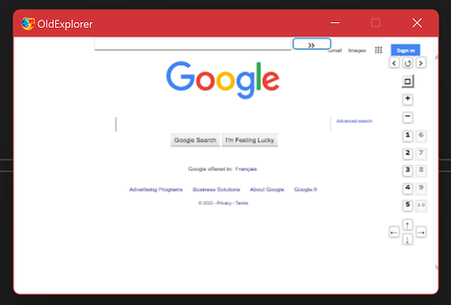

# OldExplorer

An old explorer made of WebBrowser 2, to keep it safe for legacy purposes.

## Related links and source
- https://github.com/MicrosoftEdge/WebView2Browser

Icon by The Yellow Icon
- https://fr.findicons.com/icon/72643/firefox

## Development environment
- Win10 64bit + Visual Studio 2022
